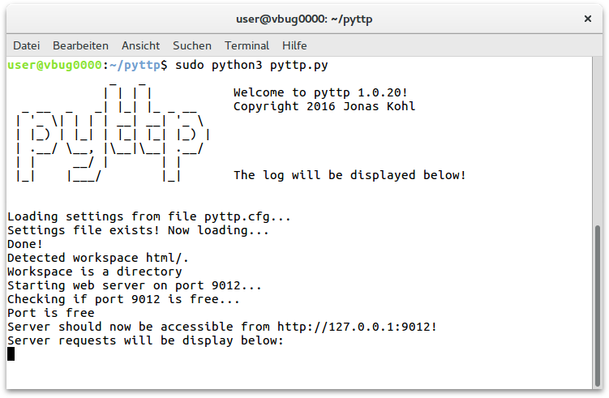

# pyttp
Lightweight Python web server

##What is pyttp?
pyttp is a small and light-weight HTTP server written in [Python](https://python.org).

## Download
Click [here](https://github.com/jonaskohl/pyttp/archive/master.tar.gz) to download pyttp.

## Installation
Make sure you have [Python](https://python.org) 3 (pyttp was written using Python 3.5.2) installed. Then extract the archive you downloaded above.
Finally run the following command inside the extracted folder:

Windows: `python.exe pyttp.py`  
Linux: `sudo python3 pyttp.py`

## Configuration
To change the server's behaviour, feel free to change the `pyttp.cfg` file.

## Screenshots
There is nothing great to see. The following screenshot was taken on Ubuntu 16.04 with GNOME 3:
